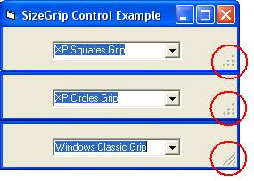



## SizeGrip Control \(Update\)

### Description

Need to add a Sizing Grip to your form without the ComCtl32 overhead? Wish you could have a control which detects the OS version, applies the correct style (Windows Classic and XP Styles), and automatically adjusts it’s location based on the parent forms resize event? Then this control is for you…Simply drop the control anywhere on your form and it takes care of the rest….enjoy!
 
### More Info
 

             |
---                |---
**Submitted On**   |2005-03-30 22:00:12
**By**             |[TerriTop](https://github.com/Planet-Source-Code/PSCIndex/blob/master/ByAuthor/territop.md)
**Level**          |Beginner
**User Rating**    |4.8 (24 globes from 5 users)
**Compatibility**  |VB 3\.0, VB 4\.0 \(16\-bit\), VB 4\.0 \(32\-bit\), VB 5\.0, VB 6\.0, VB Script, VBA MS Excel
**Category**       |[Custom Controls/ Forms/  Menus](https://github.com/Planet-Source-Code/PSCIndex/blob/master/ByCategory/custom-controls-forms-menus__1-4.md)
**World**          |[Visual Basic](https://github.com/Planet-Source-Code/PSCIndex/blob/master/ByWorld/visual-basic.md)
**Archive File**   |[SizeGrip\_C1869833302005\.zip](https://github.com/Planet-Source-Code/territop-sizegrip-control-update__1-59552/archive/master.zip)

